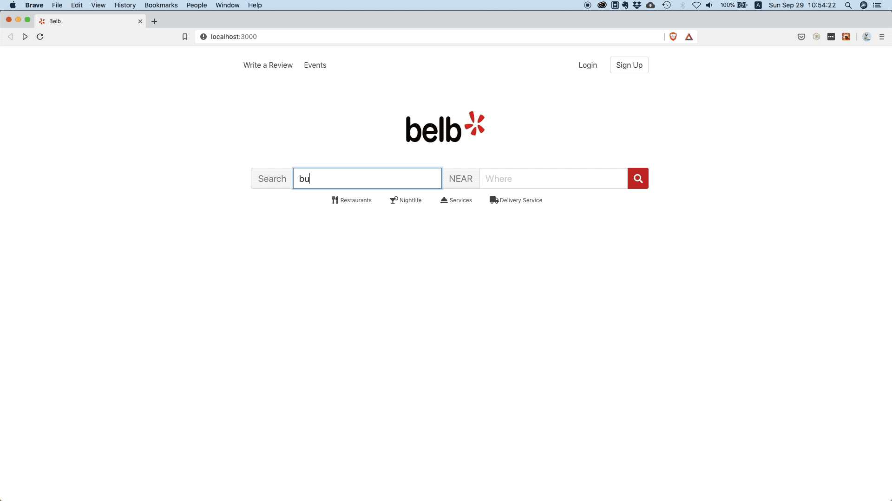

## Frontend Reactjs

Este projeto destina-se exclusivamente a fins educacionais.

Não se destina a criar nenhum tipo de concorrente do Yelp , mas aprender conceitos avançados no desenvolvimento de front-end.

## Requisitos

```
Nodejs >= 10
```
## Preview



O aplicativo usa dados reais aproveitando a API Yelp Fusion .


## Como Iniciar?

1.  **Faça o clone do repositório.**

    ```
      git clone https://github.com/geraldobl58/react-yelp.git
    ```

2.  **Instalação das dependências**

   execute na pasta do projeto o seguinte comando:

    ```npm install ou yarn
    ```

    após a instalação execute o seguinte comando.

    ```npm run start ou yarn start
    ```

3.  **Verificando no navegador**

    O projeto vai executar no seguinte endereço: `http://localhost:3000`

## Techs

 - [x] React
 - [x] Bulma
 - [x] Dotenv

## Atenção

Este aplicativo usa o CORS Anywhere porque a API REST do Yelp Fusion é destinada à comunicação de servidor para servidor e não oferece suporte a CORS

## Diretórios

Estrutura do projeto.

    .
    ├── node_modules
    ├── src
    ├──────── assets
    ├──────── components
    ├──────── hooks
    ├──────── pages
    ├──────── services
    ├── .gitignore
    ├── .prettierrc
    ├── .editorconfig
    ├── .eslint.js
    ├── package.json
    └── README.md

1.  **`/node_modules`**: Este diretório contém todos os módulos de código dos quais seu projeto depende (pacotes npm) são instalados automaticamente.

2.  **`/src`**: Este diretório conterá todo o código relacionado ao que você verá no front-end do site (o que você vê no navegador), como o cabeçalho do site ou um modelo de página. `src` é uma convenção para "código fonte ".

3.  **`.gitignore`**: Este arquivo informa ao git quais arquivos ele não deve rastrear / não manter um histórico de versão.

4.  **`.prettierrc`**: Este é um arquivo de configuração para Prettier é uma ferramenta para ajudar a manter a formatação do código consistente e para manter um padrão. [Prettier](https://prettier.io/).

5.  **`.eslint.json`**: ESLint é uma ferramenta de análise de código estática para identificar padrões problemáticos encontrados no código JavaScript. [Eslint](https://eslint.org/).

6.  **`.editorconfig`**: O EditorConfig ajuda a manter estilos de codificação consistentes para vários desenvolvedores que trabalham no mesmo projeto em vários editores e IDEs. [Editorconfig](https://editorconfig.org/)

7. **`package-lock.json`** Este é um arquivo gerado automaticamente com base nas versões exatas das dependências do npm que foram instaladas para o seu projeto. ** (Você não altera este arquivo diretamente)**

8. **`package.json`**: Um arquivo é executado para projetos Node.js, que inclui itens como metadados (nome, autor do projeto etc.). Este arquivo é como o npm sabe quais pacotes instalar para o seu projeto.
